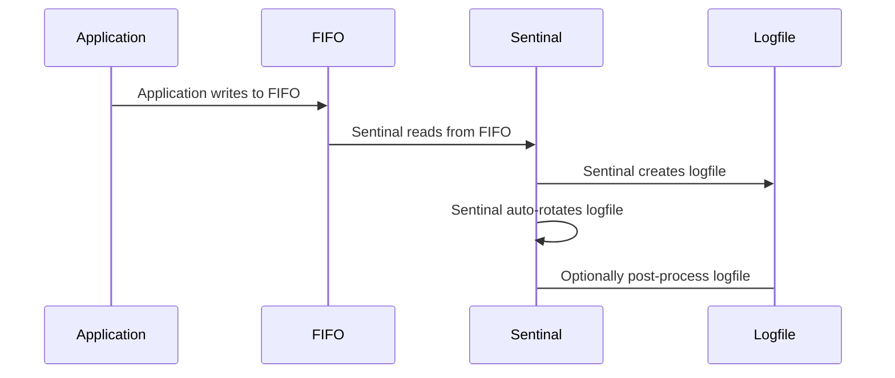

# sentinal: Software for Logfile and Inode Management

System and application processes can create many files and large files,
possibly causing disk partitions to run out of space.  sentinal is a systemd
service for managing files and filesystems to comply with the directives in
an INI configuration file.  Depending on the goals, sentinal can also act as
an adjunct or an alternative to logrotate.

Monitoring and management capabilities:

- available disk space by percentage
- available inode usage by percentage or count
- files by size, age, or retention settings
- inodes by age or retention settings
- log ingestion, processing, and rotation
- monitor and process log files when they reach a given size

## Configuration

sentinal uses INI files for its runtime configuration.  Each section in the
INI file pertains to one resource: a directory, possibly a file template,
and the conditions for managing the resource.

### INI File Description

An INI file must contain a section called `global` for the pidfile definition,
and up to 16 resources sections with unique names up to 11 characters in length.

    [global]
    pidfile:   sentinal process id and lock file, for manual logrotate

    [section]
    command:   command to run
    dirname:   thread and postcmd working directory, file location
    dirlimit:  maximum total size of matching files in a directory
    subdirs:   option to search subdirectories for matching files (false)
    pipename:  named pipe/fifo fifo location
    template:  output file name, date(1) sequences %F %Y %m %d %H %M %S %s
    pcrestr:   perl-compatible regex naming files to manage
    uid:       username or uid for command/postcmd; default = nobody
    gid:       groupname or gid for command/postcmd; default = nogroup
    rotatesiz: rotate size, M = MiB, G = GiB; 0 = no rotate (unlimited)
    expiresiz: expire size, M = MiB, G = GiB; 0 = no expiration by size
    diskfree:  percent blocks free; 0 = no monitor (off)
    inofree:   percent inodes free; 0 = no monitor (off)
    expire:    file retention time, units = m, H, D, W, M, Y; 0 = no expiration (off)
    retmin:    minimum number of files to retain; 0 = none (off)
    retmax:    maximum number of files to retain; 0 = no max (off)
    terse:     option to record or suppress file removal notices (false)
    rmdir:     option to remove empty directories (false)
    symlinks:  option to follow symlinks (false)
    postcmd:   command to run after log closes or rotates, %file = filename

`section` is the section name.  It must be unique in the INI file.

`pipename` is the path to the FIFO, either absolute or relative to dirname,
created by sentinal, owned by uid, in group gid:

    # ls -l example.log
    prw------- 1 sentinal sentinal 0 Dec  2 10:12 example.log

Note the following conditions.  If:

`command` is set, `template` must be set.

`rotatesiz` is greater than zero, sentinal rotates the log after it reaches the specified size.

`expiresiz` is greater than zero, sentinal removes files larger than the specified size at expire time.

`diskfree` is greater than zero, sentinal creates a thread to discard the oldest files to free disk space.

`inofree` is greater than zero, sentinal creates a thread to discard the oldest files to free inodes.

`expire` is greater than zero, sentinal removes files older than the specified time.

`retmin` is greater than zero, sentinal retains `n` number of files, regardless of expiration or available disk space.

`retmax` is greater than zero, sentinal retains a maximum number of `n` files, regardless of expiration.

`postcmd` is specified, the value is passed as a command to `bash -c` after the log closes or rotates.  Optional.

### Disk Space Example

To monitor console logs in /opt/sentinal/log for 20% free disk space,
and to retain at least 3 logs and at most 50 logs:

    [global]
    pidfile   = /run/diskfree.pid

    [console]
    dirname   = /opt/sentinal/log
    pcrestr   = console
    diskfree  = 20
    retmin    = 3
    retmax    = 50

This INI configuration removes gzipped files in /var/log and its subdirectories after two weeks:

    [global]
    pidfile   = /run/varlog.pid

    [zipped]
    dirname   = /var/log
    subdirs   = true
    pcrestr   = .*\.gz
    expire    = 2w

### Inode Usage Example

Remove files starting with `appdata-` when inode free falls below 15%,
or when the files are older than 7 days, or when there are more than 5M files:

    [global]
    pidfile   = /run/inode-usage.pid

    [files]
    dirname   = /path/to/appfiles
    subdirs   = true
    pcrestr   = appdata-
    inofree   = 15
    expire    = 7D
    retmax    = 5M

### Directory Usage Example

Remove myapp logs matching `myapplog-\d{8}$` when they consume more than 500MiB of disk
space or the number of logs exceeds 21:

    [global]
    pidfile   = /run/myapplog.pid

    [myapp]
    dirname   = /var/log/myapp
    dirlimit  = 500M
    pcrestr   = myapplog-\d{8}$
    retmax    = 21

### Expiration Example

This INI uses two threads to remove compressed files in /sandbox.
sandbox2M removes compressed files aged two months or older.
sandbox1M removes compressed files aged one month or older if their sizes exceed 10GiB,
logging the removals.

    [global]
    pidfile   = /run/sandbox.pid

    [sandbox2M]
    dirname   = /sandbox
    subdirs   = true
    pcrestr   = .*\.(bz2|gz|lz|zip|zst)
    expire    = 2M

    [sandbox1M]
    dirname   = /sandbox
    subdirs   = true
    pcrestr   = .*\.(bz2|gz|lz|zip|zst)
    rotatesiz = 10G
    expiresiz = 10G
    expire    = 1M
    terse     = false

### Simple Log Monitor

sentinal, using inotify, can monitor and process logs when they reach a specified size.
A sentinal section for SLM must not set `command`;
`template`, `postcmd`, and `rotatesiz` must be set.

In this example, sentinal runs logrotate on chattyapp.log when the log exceeds 50MiB in size:

    [global]
    pidfile   = /run/chattyapp.pid

    [chattyapp]
    dirname   = /var/log
    template  = chattyapp.log
    uid       = root
    gid       = root
    rotatesiz = 50M
    postcmd   = /usr/sbin/logrotate -f /opt/sentinal/etc/chattyapp.conf

This example is the same as above, adding a 20% diskfree check for logs processed by logrotate:

    [global]
    pidfile   = /run/chattyapp.pid

    [chattyapp]
    dirname   = /var/log
    template  = chattyapp.log
    pcrestr   = chattyapp\.log\.\d
    uid       = root
    gid       = root
    rotatesiz = 50M
    diskfree  = 20
    postcmd   = /usr/sbin/logrotate -f /opt/sentinal/etc/chattyapp.conf

### Logfile Ingestion and Processing

sentinal can ingest and process logs, rotate them on demand or when they reach a specified size,
and optionally post-process logs after rotation.  For logfile processing,
replace the application's logfile with a FIFO, and set sentinal to read from it.

For example, this configuration connects the dd program to example.log for log ingestion,
and rotates and compresses the log when it reaches 5GiB in size:

    [example]
    command   = /bin/dd bs=64K status=none
    dirname   = /var/log
    pipename  = example.log
    template  = example-%Y-%m-%d_%H-%M-%S.log
    pcrestr   = example-
    uid       = appowner
    gid       = appgroup
    rotatesiz = 5G
    postcmd   = /usr/bin/zstd --rm %file 2>/dev/null

This example does basically the same as above, but with inline compression (no
intermediate files), and rotates the compressed log when it reaches 1GiB in size:

    [example]
    command   = /usr/bin/zstd
    dirname   = /var/log
    pipename  = example.log
    template  = example-%Y-%m-%d_%H-%M-%S.log.zst
    pcrestr   = example-
    uid       = appowner
    gid       = appgroup
    rotatesiz = 1G

### Precedence of Keys

`retmin`, `retmax` take precedence over `dirlimit`, `diskfree`, `inofree`, `expire`.
 
`dirlimit`, `diskfree`, `inofree` take precedence over `expire`.

### File Expiration

The combinations of `expire` and `expiresiz` settings affect expiration behavior.

 - If `expire` is set, remove files at expiration time
 - If `expire` and `expiresiz` are set, remove files larger than `expiresiz` at expiration time
 - If `expiresiz` is set and `expire` is unset, take no action

### systemd unit file

sentinal runs as a systemd service.  The following is an example of a unit file:

    [Unit]
    Description=Shim to zstd-compress logs
    StartLimitIntervalSec=0
    StartLimitBurst=10
    After=network.target network-online.target systemd-networkd.service

    [Service]
    Type=simple
    Restart=always
    RestartSec=2
    User=root
    ExecStart=/opt/sentinal/bin/sentinal -f /opt/sentinal/etc/sentinal.ini
    ExecReload=/bin/kill -s HUP $MAINPID

    [Install]
    WantedBy=multi-user.target

### User/Group ID notes:

- User/Group ID applies only to `command` and `postcmd`; otherwise, sentinal runs
as the calling user.

- If an application never needs root privileges to run and process logs, consider
setting and using the application's user and group IDs in the unit file.

- Running sentinal as root is likely necessary when a single sentinal instance
monitors several different applications.

- When unspecified, the user and group IDs are set to `nobody` and `nogroup`.

## sentinal Status

The INI file /opt/sentinal/etc/example.ini is used here as an example.

    # systemctl status sentinal
    * sentinal.service - sentinal service for example.ini
         Loaded: loaded (/etc/systemd/system/sentinal.service; disabled; vendor preset: enabled)
         Active: active (running) since Wed 2021-11-24 13:01:47 PST; 4s ago
       Main PID: 13580 (sentinal)
          Tasks: 4 (limit: 76887)
         Memory: 516.0K
         CGroup: /system.slice/sentinal.service
                 `-13580 /opt/sentinal/bin/sentinal -f /opt/sentinal/etc/example.ini

    Nov 24 13:01:47 loghost systemd[1]: Started sentinal service for example.ini.
    Nov 24 13:01:47 loghost sentinal[13580]: test4: command: /usr/bin/zstd -T4
    Nov 24 13:01:47 loghost sentinal[13580]: test4: monitor file: test4- for size 1024MiB
    Nov 24 13:01:47 loghost sentinal[13580]: test4: monitor file: test4- for retmin 3
    Nov 24 13:01:47 loghost sentinal[13580]: test4: monitor file: test4- for retmax 25
    Nov 24 13:01:47 loghost sentinal[13580]: test4: monitor disk: / for 85.00% free
    Nov 24 13:01:47 loghost sentinal[13580]: test4: /opt/sentinal/tests: 87.36% blocks free

    (In this example, /opt is in the / filesystem)

## Build, Install

sentinal requires the pcre2-devel package for building the software.

    # cd sentinal
    # make
    # make install

Create a systemd unit file and add it to the local systemd directory, or run

    # make systemd

to install an example as a starting point.

    Edit /etc/systemd/system/sentinal.service as necessary.

    # systemctl daemon-reload

## Test INI Files

sentinal provides two options for testing INI files.  `-d` prints INI file
sections as parsed, where the output is similar to the input.  `-v` prints
INI file sections with the keys evaluated as they would be at run time,
including symlink resolution and relative to full pathname conversion.

## Run

    # systemctl enable sentinal
    # systemctl start sentinal

Useful commands for monitoring sentinal:

    $ journalctl -f -n 20 -t sentinal
    $ journalctl -f _SYSTEMD_UNIT=example.service
    $ ps -lT -p $(pidof sentinal)
    $ top -H -S -p $(pidof sentinal)
    $ htop -d 5 -p $(pidof sentinal)
    # lslocks -p $(pidof sentinal)

Examples of on-demand log rotation:

    # systemctl reload sentinal
    # pkill -HUP sentinal
    # kill -HUP $(cat /path/to/pidfile)

## Notes

- Linux processes which write to pipes block when processes are not reading from them.
systemd manages sentinal to ensure sentinal is always running.  See README.fifo for more detail.

- The default pipe size in Linux is either 64KB or 1MB. sentinal increases its pipe sizes on
3.x.x and newer kernels to 64MiB.  Consider this a tuning parameter that can affect performance.

- In the inline compression example, zstd can be changed to a different program, e.g.,
gzip or (p)bzip2, though they are slower and may impact the performance of the writer application.

- For inode management, sentinal counts inodes in `dirname`, not inodes in the filesystem.

- sentinal reports free space for unprivileged users, which may be less than privileged
users' values reported by disk utility programs.

- The `rotatesiz` key represents bytes written to disk.  When `command` specifies a
compression program, log rotation occurs after sentinal writes `rotatesiz` bytes
post-compression.  If unset or zero, the thread requires some form of manual log rotation.

- sentinal removes empty directories within `dirname` when `rmdir` is true.
To preserve a single directory, create a file in the directory with a file name
that does not match `pcrestr`, for example, `.persist`.

