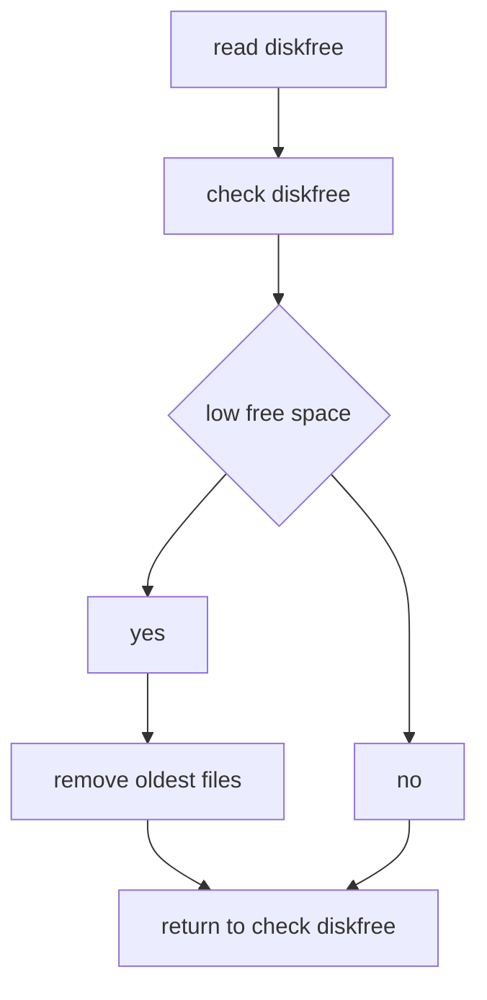
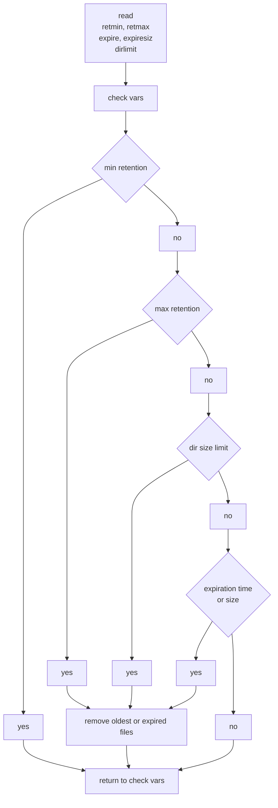
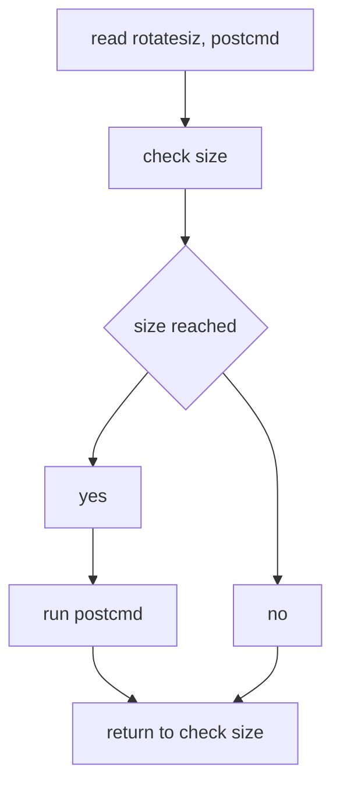

sentinal: Software for Logfile and Inode Management
===================================================

System and application processes can create many files and large files,
possibly causing disk partitions to run out of space. **sentinal** is a systemd
service for managing files and filesystems to comply with the directives in
an INI configuration file. Depending on your goals, sentinal can also act as
an adjunct or an alternative to logrotate.

**Monitoring and management capabilities:**

*   Available filesystem disk space by percentage
*   Available filesystem inode usage by percentage or count
*   Expire files by size, age, or retention settings
*   Inodes by age or retention settings
*   Log ingestion, processing, and rotation
*   Monitor and process log files when they reach a given size

Usage
-----

```txt
Usage: sentinal -f ini-file [-dsDvV]
 -f, --ini-file   INI file, full path or relative to /opt/sentinal/etc
 -d, --debug      print the INI file, exit
 -s, --split      print the INI file with split sections, exit
 -D, --dry-run    don't remove anything
 -v, --verbose    print the INI file as interpreted, exit
 -V, --version    print version number, exit
 -?, --help       this message
```

Configuration
-------------

sentinal uses INI files for its runtime configuration. Each section in the
INI file pertains to one resource: a directory, possibly a file template,
and the conditions for managing the resource.

### INI File Description

An INI file must contain a section called `global`. This section must include
a `pidfile` definition and an optional `sqlite3` database definition. The database
name can be `:memory:`, or a pathname of a disk file.

Section names can be up to 11 characters in length (kernel max), and characters
must be alphanumeric or underscore (valid sqlite3 table name).
Section names must be unique in the INI file.

**\[global\]**

*   `pidfile`: sentinal process ID and lock file, for manual logrotate
*   `database`: name of the sqlite3 database

**\[section\]**

*   `command`: command to run
*   `dirname`: thread and postcmd working directory, file location
*   `dirlimit`: maximum total size of matching files in a directory, SI or non-SI units, 0 = no max (off)
*   `subdirs`: option to search subdirectories for matching files (true)
*   `pipename`: named pipe/fifo file, full path or relative to dirname
*   `template`: output file name, date(1) sequences %F %Y %m %d %H %M %S %s
*   `pcrestr`: perl-compatible regex naming files to manage
*   `uid`: username or uid for command/postcmd, default = nobody
*   `gid`: groupname or gid for command/postcmd, default = nogroup
*   `rotatesiz`: size in SI or non-SI units, 0 = no rotate
*   `expiresiz`: size in SI or non-SI units, 0 = no expiration by size
*   `diskfree`: percent blocks free, 0 = no monitor (off)
*   `inofree`: percent inodes free, 0 = no monitor (off)
*   `expire`: file retention time, units = m, H, D, W, M, Y, 0 = no expiration (off)
*   `retmin`: minimum number of files to retain, SI or non-SI units, 0 = none (off)
*   `retmax`: maximum number of files to retain, SI or non-SI units, 0 = no max (off)
*   `terse`: option to record or suppress file removal notices (false)
*   `rmdir`: option to remove empty directories (false)
*   `symlinks`: option to follow symlinks (false)
*   `postcmd`: command to run after log closes or rotates, %file = filename
*   `truncate`: option to truncate slm-managed files (false)

Sizes in bytes or files may be given in SI units {K,M,G,T}i{B,F}, non-SI units {K,M,G,T}{B,F},
or no units (literal value). Examples,
1KB = 1000 bytes, 1K or 1KiB = 1024 bytes. 1MF = 1000000 files, 1M or 1MiF = 1048576 files.

| <h4>Unit</h4> | <h4>Time</h4> |     |     | <h4>Unit</h4> | <h4>Value (Base 2)</h4> |     |     | <h4>Unit</h4> | <h4>Value (Base 10)</h4> |
| :------------ | :------------ | :-- | --- | :------------ | :---------------------- | :-- | :-- | :------------ | :----------------------- |
| m             | minutes       |     |     | KiB           | 2^10                    |     |     | KB            | 10^3                     |
| H             | hours         |     |     | Mib           | 2^20                    |     |     | MB            | 10^6                     |
| D             | days          |     |     | GiB           | 2^30                    |     |     | GB            | 10^9                     |
| W             | weeks         |     |     | TiB           | 2^40                    |     |     | TB            | 10^12                    |
| M             | months        |     |     | PiB           | 2^50                    |     |     | PB            | 10^15                    |
| Y             | years         |     |     | EiB           | 2^60                    |     |     | EB            | 10^18                    |

### Thread Requirements

**Diskfree (DFS) Thread**

*   `pcrestr`
*   One or more of the following:
    *   `diskfree`
    *   `inofree`
*   Optional:
    *   `retmin`

**Expire (EXP) Thread**

*   `pcrestr`
*   One or more of the following:
    *   `dirlimit`
    *   `expire`
    *   `retmax`
*   Optional:
    *   `retmin`

**Simple Log Monitor (SLM) Thread**

*   `command` unset (null)
*   `template`
*   `postcmd`
*   `rotatesiz`
*   Optional, likely required by use case:
    *   `uid`
    *   `gid`

**Work (log ingestion, WRK) Thread**

*   `command`
*   `pipename`
*   `template`
*   Optional, but recommended:
    *   `rotatesiz`
*   Optional:
    *   `postcmd`
*   Optional, likely required by use case:
    *   `uid`
    *   `gid`

Note the following conditions:

*   If `command` is set, `template` must be set.
*   If `rotatesiz` is set, rotate the file after it reaches the specified size.
*   If `expiresiz` is set, remove files larger than the specified size at expiration time.
*   If `diskfree` is set, create a thread to discard the oldest files to free disk space.
*   If `inofree` is set, create a thread to discard the oldest files to free inodes.
*   If `expire` is set, remove files older than the expiration time.
*   If `retmin` is set, retain `n` number of files, regardless of expiration or available disk space.
*   If `retmax` is set, retain a maximum number of `n` files, regardless of expiration.
*   If `postcmd` is specified, the value is passed as a command to `bash -c` after the file closes or rotates. (Optional.)

**Precedence of Keys:**

*   `retmin`, `retmax` take precedence over `dirlimit`, `diskfree`, `inofree`, `expire`.
*   `dirlimit`, `diskfree`, `inofree` take precedence over `expire`.

### Free Disk Space

sentinal can remove files when the filesystem they occupy falls below the free space constraint.



Example: To monitor console logs in `/opt/sentinal/log` for 20% free disk space:

```ini
[global]
pidfile   = /run/diskfree.pid
database  = :memory:

[console]
dirname   = /opt/sentinal/log
diskfree  = 20
pcrestr   = console
```

### File Expiration

sentinal can remove files when they meet one or more of the following constraints: `retmin`, `retmax`, `expire`, `expiresiz`, `dirlimit`.

The combinations of `expire` and `expiresiz` settings affect expiration behavior. If:

*   `expire` is set and `expiresiz` is unset, remove files older than the expiration time.
*   Both `expire` and `expiresiz` are set, remove files larger than `expiresiz` at the expiration time.
*   `expiresiz` is set and `expire` is unset, take no action.



**Expiration example:** This INI configuration removes gzipped files in `/var/log` and its subdirectories after two weeks:

```ini
[global]
pidfile   = /run/varlog.pid
database  = :memory:

[zipped]
dirname   = /var/log
expire    = 2w
pcrestr   = \.gz
subdirs   = true
```

**Expiration example:** This INI uses two threads to remove compressed files in `/sandbox`. The `sandbox2M` section removes compressed files aged two months or older. `sandbox1M` removes compressed files aged one month or older if their sizes exceed 10GiB, logging the removals.

```ini
[global]
pidfile   = /run/sandbox.pid
database  = :memory:

[sandbox2M]
dirname   = /sandbox
expire    = 2M
pcrestr   = \.(bz2|gz|lz|zip|zst)
subdirs   = true

[sandbox1M]
dirname   = /sandbox
expiresiz = 10G
expire    = 1M
pcrestr   = \.(bz2|gz|lz|zip|zst)
rotatesiz = 10G
subdirs   = true
terse     = false
```

**Directory usage example:** Remove `myapp` logs matching `myapplog-\d{8}$` when they consume more than 500MiB of disk space or the number of logs exceeds 21:

```ini
[global]
pidfile   = /run/myapplog.pid
database  = :memory:

[myapp]
dirname   = /var/log/myapp
dirlimit  = 500M
pcrestr   = myapplog-\d{8}$
retmax    = 21
```

### Simple Log Monitor

sentinal, using inotify, can monitor and process logs when they reach a specified size. A sentinal section for SLM must **not** set `command`. The keys `template`, `postcmd`, and `rotatesiz` must be set.



In this example, sentinal runs logrotate on `chattyapp.log` when the log exceeds 50MiB in size:

```ini
[global]
pidfile   = /run/chattyapp.pid
database  = :memory:

[chattyapp]
dirname   = /var/log
uid       = root
gid       = root
postcmd   = /usr/sbin/logrotate -f /opt/sentinal/etc/chattyapp.conf
rotatesiz = 50M
template  = chattyapp.log
```

This example is the same as above, adding a 20% diskfree check for logs processed by logrotate:

```ini
[global]
pidfile   = /run/chattyapp.pid
database  = :memory:

[chattyapp]
dirname   = /var/log
diskfree  = 20
uid       = root
gid       = root
pcrestr   = chattyapp\.log\.\d
postcmd   = /usr/sbin/logrotate -f /opt/sentinal/etc/chattyapp.conf
rotatesiz = 50M
template  = chattyapp.log
```

### Logfile Ingestion and Processing

sentinal can ingest and process logs, rotate them on demand or when they reach a
specified size, and optionally post-process logs after rotation. For logfile processing,
replace the application's logfile with a FIFO, and set sentinal to read from it.


For example, this configuration connects the `dd` program to `example.log` for log
ingestion, and rotates and compresses the log when it reaches 5GiB in size:

```ini
[example]
dirname   = /var/log
command   = /bin/dd bs=64K status=none
uid       = appowner
gid       = appgroup
pcrestr   = example-
pipename  = example.log
postcmd   = /usr/bin/zstd --rm %file 2>/dev/null
rotatesiz = 5G
template  = example-%Y-%m-%d_%H-%M-%S.log
```

This example does the same as above, but with inline compression (no intermediate files),
and rotates the compressed log when it reaches 1GiB in size:

```ini
[example]
dirname   = /var/log
command   = /usr/bin/zstd
uid       = appowner
gid       = appgroup
pcrestr   = example-
pipename  = example.log
rotatesiz = 1G
template  = example-%Y-%m-%d_%H-%M-%S.log.zst
```

### Systemd Unit File

sentinal runs as a systemd service. The following is an example of a unit file:

```ini
[Unit]
Description=Shim to zstd-compress logs
StartLimitIntervalSec=0
StartLimitBurst=10
After=network.target network-online.target systemd-networkd.service

[Service]
Type=simple
Restart=always
RestartSec=2
User=root
ExecStart=/opt/sentinal/bin/sentinal -f /opt/sentinal/etc/sentinal.ini
ExecReload=/bin/kill -s HUP $MAINPID

[Install]
WantedBy=multi-user.target
```

### User/Group ID Notes

*   User/Group ID applies only to `command` and `postcmd`; otherwise, sentinal runs as the calling user.
*   If an application never needs root privileges to run and process logs, consider setting and using the application's user and group IDs in the unit file.
*   Running sentinal as root is likely necessary when a single sentinal instance monitors several different applications.
*   When unspecified, the user and group IDs are set to `nobody` and `nogroup`.

### Exported Environment Variables

sentinal exports the following variables to `command` and `postcmd`:

*   `HOME`: home of uid, default `/tmp`
*   `PATH`: `/usr/bin:/usr/sbin:/bin`
*   `SHELL`: `/bin/bash`
*   `PWD`: `dirname` value from INI file
*   `TEMPLATE`: `template` value from INI file
*   `PCRESTR`: `pcrestr` value from INI file

Sentinal Status
---------------

The INI file `/opt/sentinal/etc/example2.ini` is used here as an example.

```shell
# systemctl status sentinal
* sentinal.service - sentinal service for example2.ini
     Loaded: loaded (/etc/systemd/system/sentinal.service; disabled; vendor preset: enabled)
     Active: active (running) since Wed 2021-11-24 13:01:47 PST; 4s ago
   Main PID: 13580 (sentinal)
      Tasks: 4 (limit: 76930)
     Memory: 852.0K
     CGroup: /system.slice/sentinal.service
             `-13580 /opt/sentinal/bin/sentinal -f /opt/sentinal/etc/example2.ini

Nov 24 13:01:47 loghost sentinal[13580]: example2: start dfs thread: /opt/sentinal/tests
Nov 24 13:01:47 loghost sentinal[13580]: example2: monitor disk: / for 85.00% free
Nov 24 13:01:47 loghost sentinal[13580]: example2: monitor file: example2- for retmin 3
Nov 24 13:01:47 loghost sentinal[13580]: example2: /opt/sentinal/tests: 87.06% blocks free
Nov 24 13:01:47 loghost sentinal[13580]: example2: start exp thread: /opt/sentinal/tests
Nov 24 13:01:47 loghost sentinal[13580]: example2: monitor file: example2- for retmin 3
Nov 24 13:01:47 loghost sentinal[13580]: example2: monitor file: example2- for retmax 25
Nov 24 13:01:47 loghost sentinal[13580]: example2: start wrk thread: /opt/sentinal/tests
Nov 24 13:01:47 loghost sentinal[13580]: example2: command: /usr/bin/zstd -T4
Nov 24 13:01:47 loghost sentinal[13580]: example2: monitor file: example2- for size 1024MiB

(In this example, /opt is in the / filesystem)
```

Build and Install
-----------------

sentinal requires the `pcre2-devel` package for building the software.

```shell
# cd sentinal
# make
# make install
```

Create a systemd unit file and add it to the local systemd directory, or run:

```shell
# make systemd
```

to install an example as a starting point.

Edit `/etc/systemd/system/sentinal.service` as necessary.

```shell
# systemctl daemon-reload
```

Test INI Files
--------------

sentinal provides two options for testing INI files:

*   `-d` or `--debug` prints INI file sections as parsed, resembling the input.
*   `-v` or `--verbose` prints INI file sections with the keys evaluated as they would be at runtime, including symlink resolution and relative-to-full pathname conversion.

Run
---

```shell
# systemctl enable sentinal
# systemctl start sentinal
```

Useful commands for monitoring sentinal:

```shell
# journalctl -f -n 20 -t sentinal
# journalctl -f _SYSTEMD_UNIT=example.service
$ ps -lT -p $(pidof sentinal)
$ top -H -S -p $(echo $(pgrep sentinal) | sed 's/ /,/g')
$ htop -d 5 -p $(echo $(pgrep sentinal) | sed 's/ /,/g')
# lslocks -p $(pidof sentinal)
# pmap -X $(pidof sentinal)
```

Examples of on-demand log rotation:

```shell
# systemctl reload sentinal
# pkill -HUP sentinal
# kill -HUP $(cat /path/to/pidfile)
```

Notes
-----

*   Linux processes writing to pipes block when processes are not reading from them. systemd manages sentinal to ensure sentinal is always running. See `README.fifo` for additional information about FIFO behavior.
*   The default pipe size in Linux is either 64KB or 1MB. sentinal increases its pipe sizes on 3.x.x and newer kernels to 64MiB. Consider this a tuning parameter that can affect performance.
*   In the inline compression example, `zstd` can be changed to a different program, e.g., `gzip` or `(p)bzip2`, though they are slower and may impact the performance of the writer application.
*   For inode management, sentinal counts inodes in `dirname`, not inodes in the filesystem.
*   sentinal reports free space for unprivileged users, which may be less than privileged users' values reported by disk utility programs.
*   The `rotatesiz` key represents bytes written to disk. When `command` is a compression program, log rotation occurs after sentinal writes `rotatesiz` bytes post-compression. If `rotatesiz` is unset or zero, the thread requires manual or cron-based log rotation.
*   sentinal removes empty directories within `dirname` when `rmdir` is true. To preserve a single directory, create a file in the directory with a file name that does not match `pcrestr`, for example, `.persist`.
*   sentinal does not descend into directories in other filesystems, similar to `find dir -xdev`.

